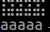
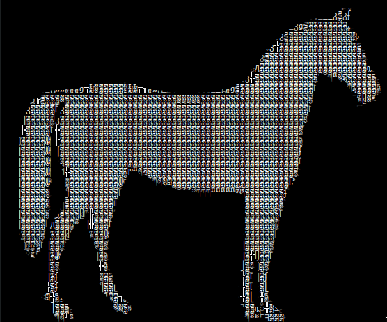
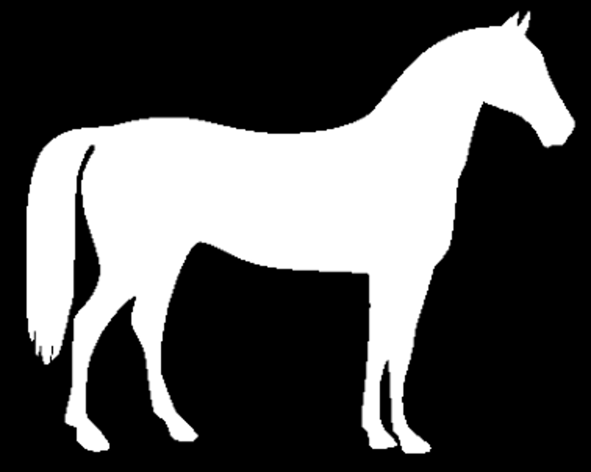
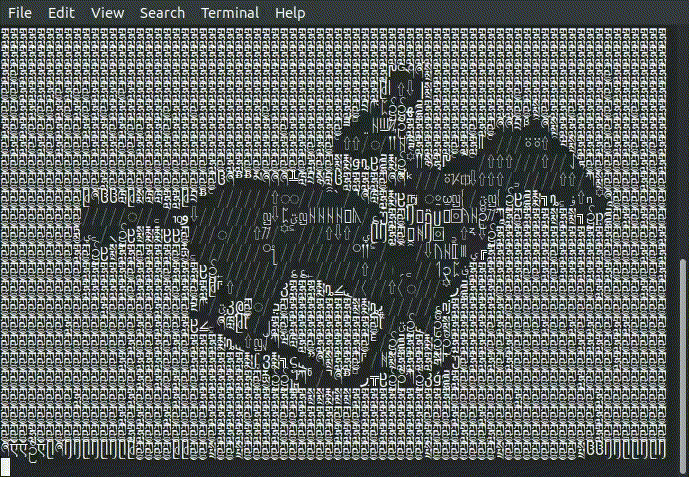
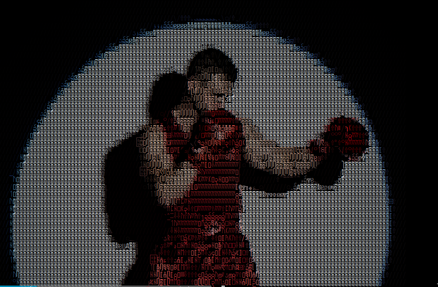

# img2unicode-demos
Demos of capabilities of the matrach/img2unicode - terminal rendering tool.

Note, that the images are optimized for Ubuntu Mono font rendered by libvte.
Most of monospace fonts are not really properly sized, i.e. Braille glyphs width is about 1.5x the width of ASCII, and therefore GitHub's rendering is different from libvte (Gnome Terminal etc.), which forces the characters to be either single wide or double-wide (with some exceptions).

Consider the following 5 Braille glyphs and 5 ascii glyphs:
<pre font="Ubuntu Mono">
⣯⣯⣯⣯⣯
aaaaa
</pre>
And compare the rendering to libvte's, where characters overlap:

# Samples

Compare the following works.
## Limited to ASCII and B&W
(Optimized for Ubuntu Mono font, not GitHub's default.)
<pre font="Ubuntu Mono">
                                                                       _       
                                                                ____y@QF       
                                                           _y@@@@@@@@@@_       
                                                        _y@@@@@@@@@@@@@@@_     
                                                      _q@@@@@@@@@@@@@@@@@@     
                                                     j@@@@@@@@@@@@@@@@@@@@k    
                                                   _@@@@@@@@@@@@@@@@@@@@@@@k   
                                                 _y@@@@@@@@@@@@@B  ""M@@@@@@@_ 
         ____,ypq@@@@@@@@@@@@pp____       ____pq@@@@@@@@@@@@@@@@L      "@@@@@B 
      _@@@@@@@@@@@@@@@@@@@@@@@@@@@@@@@@@@@@@@@@@@@@@@@@@@@@@@@@B         %@BF  
     @@@@@@F@@@@@@@@@@@@@@@@@@@@@@@@@@@@@@@@@@@@@@@@@@@@@@@@@@@L               
    j@@@@@Ej@@@@@@@@@@@@@@@@@@@@@@@@@@@@@@@@@@@@@@@@@@@@@@@@@@F                
    @@@@@@L@@@@@@@@@@@@@@@@@@@@@@@@@@@@@@@@@@@@@@@@@@@@@@@@@@@                 
    @@@@@@ @@@@@@@@@@@@@@@@@@@@@@@@@@@@@@@@@@@@@@@@@@@@@@@@@@B                 
   J@@@@@@ J@@@@@@@@@@@@@@@@@@@@@@@@@@@@@@@@@@@@@@@@@@@@@@@@@E                 
   J@@@@@@  @@@@@@@@@@@@@@@@@@@@@@@@@@@@@@@@@@@@@@@@@@@@@@@@@L                 
   J@@@@@@  J@@@@@@@@@@@@@P"M%@@@@@@@@@@@@@@@@@@@@@@@@@@@@@@@                  
   J@@@@@@   3@@@@@@@@@@@"     "fM@@@@@@@@@@@@@@@@@@@@@@@@@P`                  
   J@@@@@@   j@@@@@@@@@@"           ``""""""""""ff@@@@@@@@F                    
   J@@@@@@  _@@@@@@@@@@F                          @@@@@@@@                     
   J@@@@@B _@@@@R"@@@@@                           @@@@@@@F                     
   J@@@@@L@@@@@"  @@@@F                           @@@@@@B                      
    @@@@B @@@B    9@@@                            @@@@@@`                      
     @@@L @@B      3@B                            @@@@@@                       
      P"  @@       J@B                           J@@Q@@F                       
          @B        @@                           j@F`@@                        
         j@[        ]@k                          @@L @E                        
         @@[        J@@L                         @@L @k                        
         B@@_        "N@@_                       @@[ @@                        
          3@@@_        N@@k                      "@@p/@@y_                     
           "PP"                                   """"JRRP                     
</pre>

## B&W Unicode
Rendered by libvte (Gnome Terminal etc.).
Compare the rendered image (left) with original (right).

 

 

## 24-bit color Unicode
The tool really shines when rendering with 24-bit colors, which is supported by most modern terminal emulators.
Compare the rendered image (top) with original (bottom).

You can also watch converted Big Buck Bunny (compare with [the original movie](https://www.youtube.com/watch?v=aqz-KE-bpKQ)):

# License
All content is based on either CC0, Public Domain or [Pixabay](<https://pixabay.com/service/license/>) work. The actual content in licensed under CC0 or Pixabay License, whichever has precedence.
