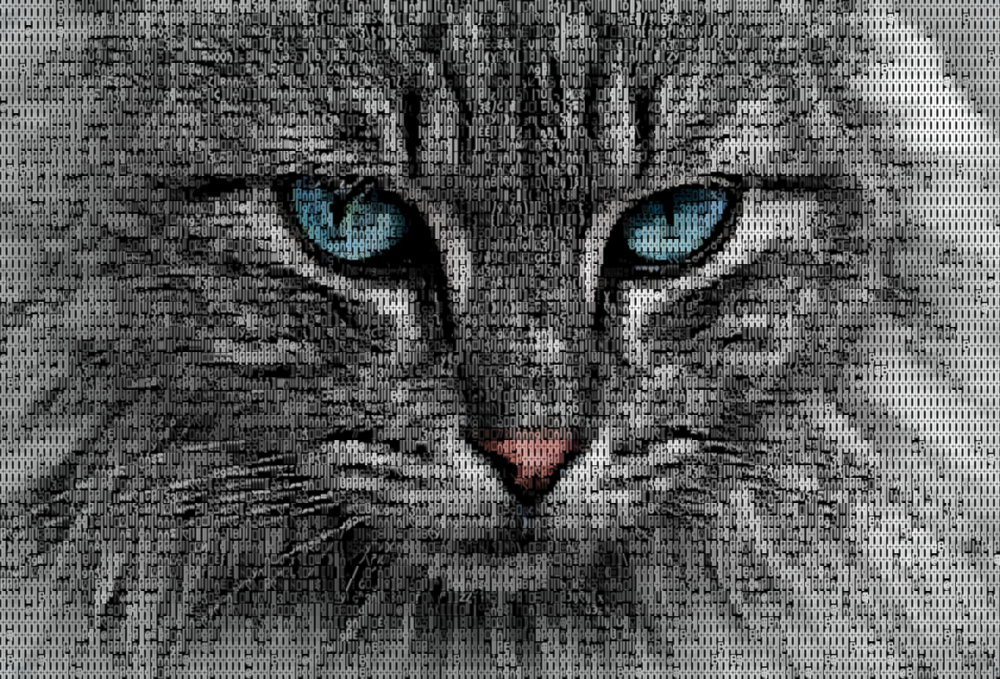
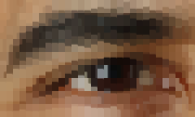

| Dual | Gamma |
| ---- | ----- |
|  |  | 
|  |  | 
|  |  | 
|  |  | 
|  |  | 
|  |  | 
|  |  | 
|  |  | 
|  |  | 
|  |  | 
|  |  | 
|  |  | 
|  |  | 
|  |  | 
|  |  | 
|  |  | 
|  |  | 
|  |  | 
|  |  | 
|  |  | 
|  |  | 
|  |  | 
|  |  | 
|  |  | 
|  |  | 
|  |  | 
|  |  | 
|  |  | 
|  |  | 
|  |  | 
|  |  | 
|  |  | 
|  |  | 
|  |  | 
|  |  | 
|  |  | 
|  |  | 
